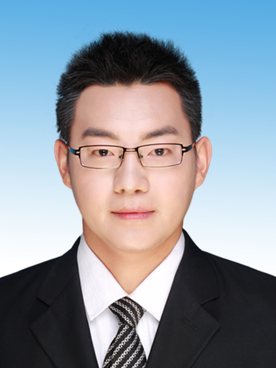

<a href="#" onclick="printResume()">打印</a> <a href="./assets/resume/简历--骆乃斌.docx">下载word格式</a> <a href="./assets/resume/简历-骆乃斌.pdf">下载PDF格式</a>

---

### 联系方式

- 手机：135-8578-7696 
- Email：<a href="mailto:jsluonaibin@163.com">jsluonaibin@163.com</a>
- 微信号：luonaibin001

---

### 个人信息

 - 骆乃斌/男/1989 
 - 研究生/上海大学计算机系
 - 籍贯：江苏省宿迁市 
 - 通信地址：上海市宝山区南陈路333号计算机楼
 - 微博：[@落叶飘香001](http://weibo.com/u/2438098050)
 - 技术博客：[http://luonaibin.github.io](http://luonaibin.github.io/)
 - Github: [https://github.com/luonaibin](https://github.com/luonaibin) 
 - 期望职位：Java/J2EE高级程序员，系统架构师，数据分析师
 - 预计毕业时间：2016-04-015
 - 期望薪资：税前月薪10k~15k，特别喜欢的公司可例外
 - 期望城市：上海

---

###教育经历
 
 - 2013.9--2016.4 上海大学 | 计算机应用技术 | 硕士
 - 2009.9--2013.6 长春工程学院 | 计算机科学与技术 | 本科

---
### 专业技能

以下均为我熟练使用的技能

- Java/J2EE：熟练掌握Java基本语法，熟悉Java库。了解JSP、HTML5、CSS、Bootstrap。
- 数据结构及算法：熟练掌握基本的数据结构，熟悉基本的排序、搜索算法，以及一些经典的动态规划算法。
- 数据库相关：熟悉MySQL/SQL Server, 熟悉SQL语句。
- Linux：了解linux常用命令。
- Python：了解python基本语法，并使用python做过相关的机器学习实践。
- 机器学习/数据挖掘具：了解一些经典的机器学习/数据挖掘理论和一些算法。
- 版本管理、文档和自动化部署工具：Git/Svn.

---

### 实习经历

 - 上海携程&nbsp;&nbsp;&nbsp;&nbsp;&nbsp;&nbsp;&nbsp;&nbsp;&nbsp;&nbsp;&nbsp;&nbsp;&nbsp;机票研发部平台组
 
2015.6--2015.7&nbsp;&nbsp;&nbsp;使用C#技术完成组内网站搭建相关工作。

---
###项目经历
#### 网络问卷调查数据挖掘系统 
 * 项目描述

网络问卷调查数据挖掘系统，主要是通过分析网络问卷调查数据，分析问卷用户的答题习惯，并建立相关模型。

 * 项目职责
 
主要负责基于关联规则的数据挖掘模块，通过分析用户属性，问卷属性和用户答题习惯之间的数据关系，建立关联规则模型。

 * 项目成果
 
项目周期4个月，成功使用问卷数据建立关联分析模型，并且使用该模型可以分析不同用户的特征。

#### 华测创时矿井监测系统 
 * 项目描述
 
华测创时矿井监测系统，主要是通过各种传感器数据，以及人员位置信息来实时监测井下环境的情景系统。主要模块有矿井布局结构建模、井下环境监测及报警、井下人员定位、用户管理的模块。

 * 项目职责
 
主要负责用户管理的模块，设计并布局系统的人事管理模块，包括人员信息管理、部门管理、权限管理等。

 * 项目成果
 
项目周期4个月，于2013年12月完成相关功能调试。

#### ... ...

---

#### 校内经历

 - [2015.1]: 上海科技馆志愿者服务
 - [2013.9--2015.5] : 积极参加学校学术节|体育节|艺术节
 
---

### 所获荣誉

##### 研究生：
 * 2014.11： 	校三等奖学奖。
 * 2014.11： 	上海大学ACM竞赛优胜奖。

##### 本科生：

* 2013.06：    获得优秀学生。
* 2012.06：	  获得英语六级证书；
* 2010--2012：	获得学校二、三等奖奖学金；

---

### 自我评价

 * 做事：  做事专注认真, 抗压能力强；喜欢接受新事物；迎接挑战；
 * 为人：  以团队为中心, 能和团队保持步调一致；与人为善，和同学间关系和睦； 
 * 爱好：  阅读，跑步，羽毛球
 
---

## 致谢
感谢您花时间阅读我的简历，期待能有机会和您共事。